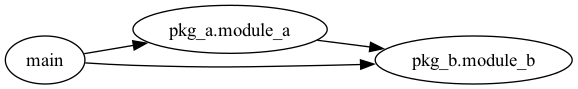
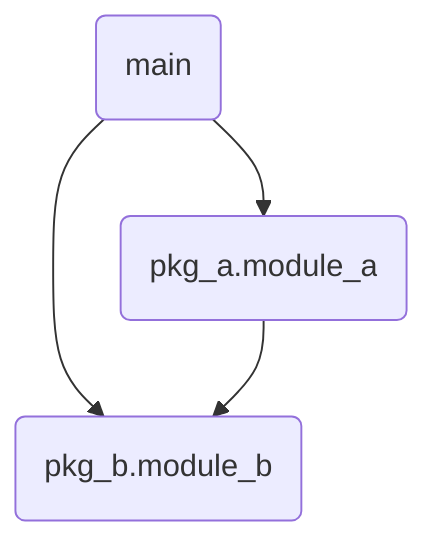
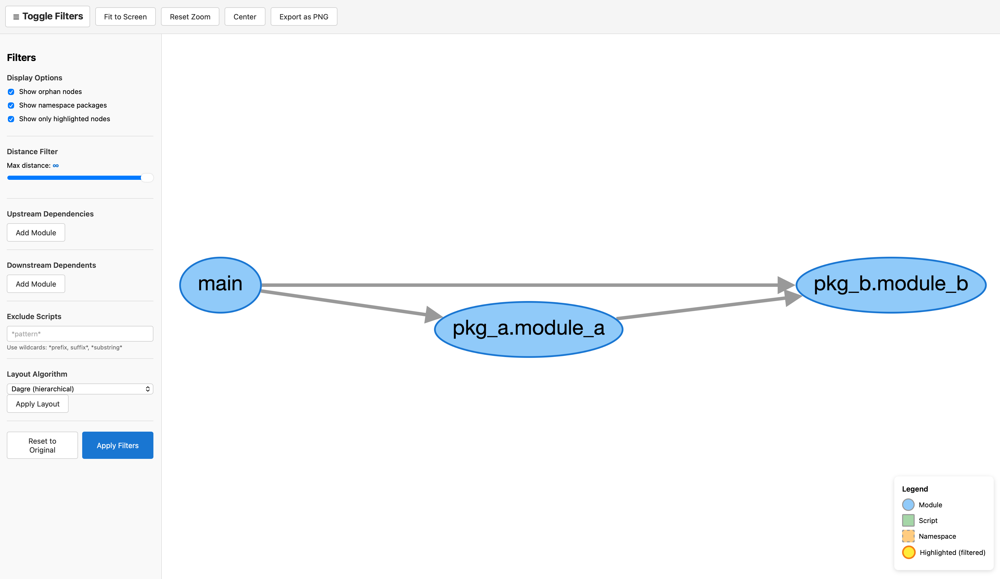
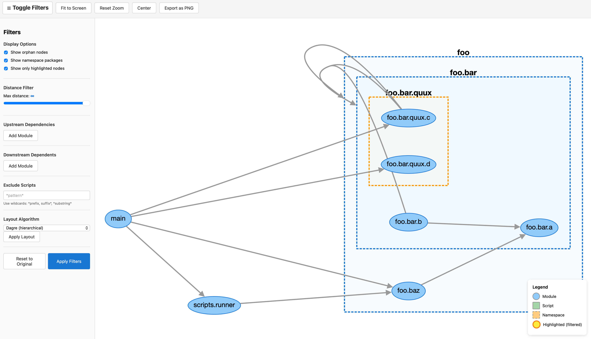
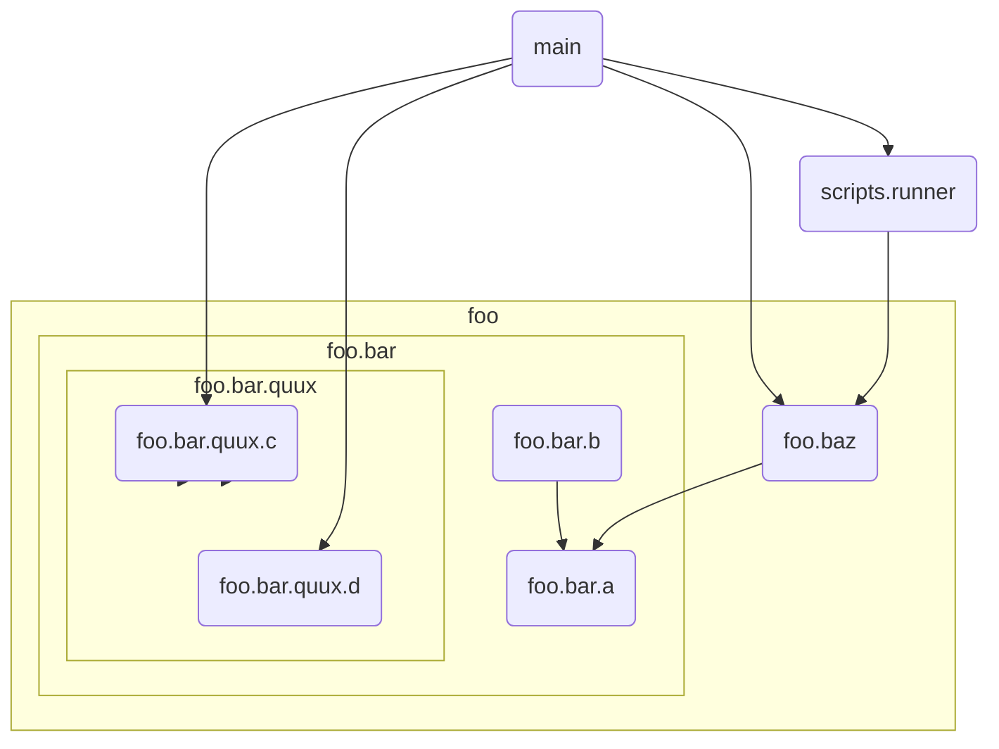

# deptree-utils
_Documentation written by an AI assistant._

Rust-powered dependency graph utilities with a focus on Python projects. The CLI parses imports using `ruff_python_parser`, resolves modules (including scripts outside the source root), and emits deterministic graphs in DOT, Mermaid, Cytoscape (HTML), or list form for upstream/downstream analysis.



The sample above is generated from `crates/deptree-cli/tests/fixtures/sample_python_project`.

## Features
- Python analyzer with automatic source-root detection (flat, `src/`, `lib/python/`) and explicit `--source-root` override.
- Multiple outputs: Graphviz DOT (default), Mermaid (`flowchart TD`), interactive Cytoscape HTML, and list mode for scripting.
- Upstream/downstream queries, `--max-rank` distance limits, `--show-all` highlighting, and CSV/repeated-flag/file-based module selection.
- Script discovery outside the source root with glob-based exclusions; scripts are shaped differently in graph outputs.
- Namespace package handling: excluded by default with transitive edges preserved; include via `--include-namespace-packages` with distinct styling.
- Orphan filtering: hidden by default; include with `--include-orphans`.
- Interactive Cytoscape HTML includes layout selection (dagre, cose/cose-bilkent, cola, elk, etc.), filtering sidebar, and PNG export.

## Quick start
```
just build          # Full pipeline: WASM → frontend → CLI
cargo run -- --help # CLI help
```

Or run directly via Nix without cloning:
```
nix run github:s-zeng/deptree-utils -- --help
```

The Nix flake provides the toolchain; `just` wraps the build steps:
- `just wasm-build` – builds `crates/deptree-wasm` and copies artifacts into `frontend/src/wasm/`.
- `just frontend-build` – bundles the TypeScript UI (runs `wasm-build` first).
- `just cli-build` / `just cli-build-release` – builds the Rust CLI.
- `just lint` – `cargo clippy --all-targets --all-features -D warnings` + `bun run lint`.
- `just clean` / `just clean-wasm` / `just clean-frontend` – remove build outputs.

## CLI usage
Analyze a project (auto-detected source root) and emit DOT:
```
cargo run --quiet --bin deptree-utils -- \
  python crates/deptree-cli/tests/fixtures/sample_python_project
```

Pick another format:
```
--format mermaid     # flowchart TD
--format cytoscape   # self-contained HTML viewer
```

Control graph contents:
```
--include-orphans                 # show isolated nodes
--include-namespace-packages      # show namespace packages (hexagons/dashed)
--exclude-scripts "old_scripts"   # skip discovered scripts (supports wildcards)
--max-rank 2                      # limit distance for upstream/downstream queries
--source-root ./project/src       # override auto-detection
```

Upstream/downstream analysis (modules can be dotted names or file paths):
```
# Who depends on pkg_a.module_a?
cargo run --quiet --bin deptree-utils -- \
  python ./path --downstream pkg_a.module_a --format mermaid

# What does scripts/runner.py depend on? Limit to distance 1 and output a list:
cargo run --quiet --bin deptree-utils -- \
  python ./path \
  --upstream scripts/runner.py \
  --max-rank 1 \
  --format list

# Show the full graph but highlight a downstream slice:
cargo run --quiet --bin deptree-utils -- \
  python ./path \
  --downstream pkg_a.module_a \
  --show-all \
  --format dot
```

Mermaid example (same sample project as the screenshot):


## Interactive Cytoscape viewer
- Generate HTML: `cargo run --quiet --bin deptree-utils -- python <path> --format cytoscape > graph.html`.
- Open `graph.html` directly in a browser (no server needed). Pan/zoom, switch layouts (dagre default; also cose, cola, concentric, grid, circle, breadthfirst, cose-bilkent, elk), filter by upstream/downstream sets, toggle orphans/namespaces, and export PNG.
- A pre-generated sample is available at `docs/assets/sample-graph.html` using the test fixture project. UI preview:



## Testing
- `cargo test` to run the suite (snapshot-based via `insta`).
- Review snapshot changes with `cargo insta review`; accept with `cargo insta accept`.
- Snapshots live in `src/snapshots/` (unit) and `tests/snapshots/` (integration). Avoid committing `.snap.new`.
- Cytoscape behavior is usually snapshot-tested via JSON graph data (`DependencyGraph::to_cytoscape_graph_data*`); HTML rendering is smoke-tested.

## Notes on behavior
- Default output hides orphan nodes and namespace packages while preserving transitive edges so the graph stays focused.
- Scripts outside the source root are first-class nodes with distinct shapes and path-based names (e.g., `scripts/blah.py` → `scripts.blah`).
- All outputs are deterministic and sorted for diffable results.

## More examples
- Namespace grouping (nested packages + script) from `crates/deptree-cli/tests/fixtures/test_namespace_grouping`:





## License
MIT; see `LICENSE`.
